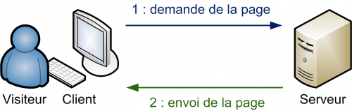
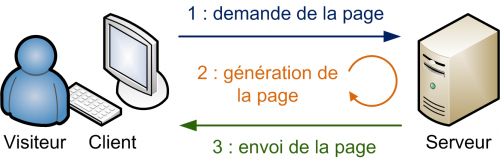

# Séance 1 : Introduction / Premiers Concepts

## PHP, qu'est ce que c'est ?

Le [PHP](https://fr.wikipedia.org/wiki/PHP) est un langage de programmation \(contrairement au HTML, langage de description\) orienté web. Il est créé en 1995 par [Rasmus Lerdorf](https://toys.lerdorf.com/), et le sigle signifie \(aujourd'hui\) : **PHP : PHP Hypertext PreProcessor**   

Contrairement au HTML/CSS ou encore le javascript dans une majorité des cas qui sont éxécutés par le navigateur du client, PHP est exécuté par un serveur. Ce qui implique que pour faire fonctionner du PHP nous avons besoin d'outils complémentaires que nous verrons par la suite.

La documentation officielle \(et en français\) [http://www.php.net](http://www.php.net). Les versions courantes de PHP sont 7.2, 7.3 et 7.4.


PHP n'est pas le seul langage serveur capable de produire du HTML/CSS. On pourrait très bien utiliser du Python, du Ruby, du C\#, ...


### Du PHP pour quoi faire ?

PHP permet de générer \(construire\) des pages web sur un serveur avant de les envoyer à un client. C'est ce qui permet de rendre des pages dites dynamiques.


Le sens de dynamique ici, et dans ce cours n'est pas le fait que la page soit animée, ou que des éléments bougent, mais que son contenu \(textes, images\), puissent varier dans le temps et en fonction d'interactions d'utilisateurs.


PHP permet aussi de traiter des formulaires web, d’accéder aux bases de données \(vous le verrez en S2\) de générer des documents HTML, PDF, Office, Zip, images, ...

## Comment fonctionne un site Web ?

### Quels types de site ?

Il faut deux parties :

* **Un client**, souvent un visiteur utilisant un navigateur web
* **Un serveur**, des ordinateurs puissants qui stockent les sites web. C'est sur ce serveur que l'on accéde en saisissant une URL \(ou une IP\).

#### Les sites statiques 

* Uniquement en HTML et CSS. 
* Le contenu est fixe et non modifiable facilement. 
* Toute modification implique de devoir modifier les fichiers html



Dans un site statique, le serveur se contente simplement de renvoyer le fichier HTML demandé, sans se poser de question.

#### Les sites dynamiques

* Le résultat est toujours en HTML et CSS . 
* Implique aussi du PHP et souvent du MySQL. 
* Le contenu est dynamique car il peut changer sans l’intervention du webmaster



Un étape supplémentaire est nécessaire. En effet, les pages n’existent pas dans un état visible par les client. Elles doivent être construites en fonction des interactions des clients et des données disponibles \(dans une base de données par exemple\). Deux clients différents peuvent donc ne jamais voir la même page \(dans le cas d’une recherche par exemple\)


Aujourd'hui, la quasi totalité des sites web sont dynamiques.


## Première page web

```php
<!DOCTYPE html>
<html lang="fr">
<head>
    <title>Ma page avec du PHP</title>
    <meta charset="utf-8" />
</head>
<body>
    <?php
        echo 'Hello World';
    ?>
</body>
</html>
```

### Comment faire fonctionner cet exemple

#### Le nécessaire pour faire du PHP

* Un éditeur de texte \(notepad++, sublimeText, VSCode\) ou un **IDE php \(PhpStorm, NetBeans\)** 
* Un serveur PHP \(distant : un hébergeur, votre espace personnel\), local \(WampServer, MAMP, ...\) 
* Un client FTP \(si votre serveur est distant, ex. FileZilla\) 
* Un navigateur \(un client\)


Vous devez utiliser PhpStorm dans ce module. Il est accessible gratuitement pour les étudiants : [https://www.jetbrains.com/fr-fr/community/education/\#students](https://www.jetbrains.com/fr-fr/community/education/#students)


#### Étapes pour le test de l’exemple précédent

1. Créer un fichier "index.php" avec le code précédent 
2. Connectez vous au serveur distant avec votre client FTP. 
3. Déposer le fichier "index.php" dans le répertoire "public\_html/m1202" \(vous pourrez créer des répertoires par la suite\) 
4. Ouvrez ce fichier en saisissant son adresse dans votre navigateur web [http://votreip/m1202/index.php](http://votreip/m1202/index.php)

#### Explications du code

1. ligne 8 : `<?php` : ouverture de la balise php, nécessaire pour écrire du code php
2. ligne 9 : `echo 'Hello World';`: L’instruction echo permet de dire à PHP d’écrire du code HTML. le ; est obligatoire à chaque instruction PHP 
3. ligne 10 : `?>` : fermeture du bloc PHP

#### Quelques remarques

* On travaille **TOUJOURS** en chemin relatif \(par rapport au fichier dans lequel on est !\) 
* On n’utilisera jamais d’espace ou de caractères spéciaux pour nommer les répertoires et les fichiers. Seul le \_ est autorisé ! 
* Les noms des variables PHP respecterons les mêmes règles ! 
* Un fichier PHP à **TOUJOURS** une extension .php, sinon il ne fonctionne pas !

## Exercice 1


Jouez le jeu, ne regardez pas la correction avant de tester




* Tester votre premier fichier 
* Modifier le fichier pour écrire votre nom en plus de "Hello World" 
* Que se passe-t’il ?



Selon la manière dont vous avez écrit le code, le texte est collé "Hello WorldDavid". Il n’y a pas de retour chariot ! Il faudrait l’écrire en HTML. Pour cela on ajoute la balise HTML `<br>` dans un `echo`.

Et le code pourrait devenir

```php
<!DOCTYPE html>
<html lang="fr">
<head>
    <title>Ma page avec du PHP</title>
    <meta charset="utf-8" />
</head>
<body>
    <?php
        echo 'Hello World';
        echo '<br>';
        echo 'David'; //on pourrait aussi mettre un espace echo ' david';
    ?>
</body>
</html>
```



## Exercice 2



* Corriger le code précédent 
* Écrivez je m'appelle xxx, plutôt que simplement votre nom 
* Que se passe-t’il ?



Selon, comment vous avez écrit le code, vous devriez avoir un message d'erreur à cause des '. Les ’'servent à informer PHP du texte à écrire. Pour pouvoir écrire un ' dans un `echo`, il faut utiliser le **\ \(caractère d'échappement\)** et noter **\'**

Le code devrait donc ressembler à 

```php
<!DOCTYPE html>
<html lang="fr">
<head>
    <title>Ma page avec du PHP</title>
    <meta charset="utf-8" />
</head>
<body>
    <?php
        echo 'Hello World';
        echo '<br>';
        echo 'Je m\'appelle David';
</body>
</html>
```



## Les instructions de base

### Notion de séquence en programmation

Quand on écrit plusieurs instructions PHP, le moteur PHP les exécute une par une, en séquence, de gauche à droite, et de haut en bas. L’ordre à donc de l’importance. 

```php
<?php 
echo 'Bonjour'; 
echo 'David '; 
echo 'Je suis enseignant';
echo 'en DUT MMI';
?>
```

### L'instruction echo


`echo` permet d’écrire ce qui la suit lorsque le code est interprété \(généralement du contenu HTML\). `echo` peut être suivi d’une chaîne de caractères entre '.

```php
<?php
echo 'Bonjour';
?>
// Affiche 
// Bonjour
```

`echo` peut être suivi \(ou composée\) de **variables**, c’est la valeur de ces **variables** qui seront affichés. 

```php
<?php
echo 'Bonjour ';
$variable = 12;
echo $variable;
?>
// Affiche
// Bonjour 12
```

`echo` peut être suivi de toute les combinaisons de chaînes de caractères et de variables possible. Il faut dans ce cas les séparer par des points \(**.**\). Le . \(point\) est l’opérateur de **concaténation** ou de collage.

```php
<?php
$moyenneUE1 = 12;
$moyenneUE2 = 19;
echo 'je suis David, j\'ai ' . $moyenneUE1 . ' de moyenne
en UE1 et ' . $moyenneUE2 . ' en UE2.';
?>
// Affiche 
// je suis David, j'ai 12 de moyenne en UE1 et 19 en UE2.
```

Toutes les combinaisons ci-dessous, donne le même résultat :

```php
<?php
echo 'Bonjour David';

echo 'Bonjour ' . 'David';

echo 'Bonjour ';
echo 'David';
?>
```

### Exercice



Voici un début de code 

```php
<!DOCTYPE html>
<html lang="fr">
<head>
    <title>Ma page avec du PHP</title>
    <meta charset="utf-8" />
</head>
<body>
<?php 
    $nom = 'Annebicque'; 
    $prenom = 'David'; 
    $age = 36; 
?>
</body>
</html>
```

Écrire le code qui donne le résultat suivant : 


Bonjour, je suis David Annebicque, j’ai 36 ans.




```php
<!DOCTYPE html>
<html lang="fr">
<head>
    <title>Ma page avec du PHP</title>
    <meta charset="utf-8" />
</head>
<body>
<?php 
    $nom = 'Annebicque'; 
    $prenom = 'David'; 
    $age = 36; 
    echo 'Bonjour, je suis '.$prenom.' '.$nom.' , j\'ai '.$age.' ans.';
?>
</body>
</html>
```



### Générer du HTML

Jusqu’à maintenant nous avons utiliser le PHP pour produire du texte \(une fois les fichiers interprétés\). C’est donc assez limité comme utilisation. Le but essentiel du PHP est de générer des pages web \(ou des PDF, des images, ...\) Comment faire selon-vous ?

Le HTML c’est des balises, et des balises c’est du texte !

```php
<!DOCTYPE html>
<html lang="fr">
<head>
    <title>Ma page avec du PHP</title>
    <meta charset="utf-8" />
</head>
<body>
<?php
    echo '<strong>Hello World</strong>';
?>
</body>
</html>
```

Selon votre navigateur le texte sera en gras :  **Hello World**

On pourrait écrire le code **ci-dessous** pour obtenir le même résultat

```php
<!DOCTYPE html>
<html lang="fr">
<head>
    <title>Ma page avec du PHP</title>
    <meta charset="utf-8" />
</head>
<body>
    <strong>
    <?php
        echo 'Hello World';
    ?>
    </strong>
</body>
</html>
```

#### Comment écrire des attributs ?

```php
<!DOCTYPE html>
<html lang="fr">
<head>
    <title>Ma page avec du PHP</title>
    <meta charset="utf-8" />
</head>
<body>
<?php
    echo '<p style="color:red;">Hello World</p>';
?>
</body>
</html>
```

Cet exemple va afficher Hello World en rouge.

### Exercice

Ecrire le code PHP permettant d'afficher une image ?

## 

### 




