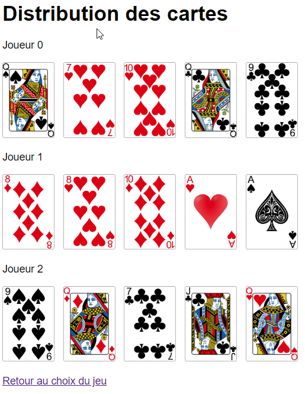

# Séance 10 : Manipulation de tableaux et des formulaires

## Présentation

* On souhaite faire un programme qui va distribuer des cartes à des joueurs.
* On part avec un jeu de 32 cartes et on veut distribuer un certain nombre de cartes à un certain nombre de joueurs \(on choisit avec un autre formulaire\).
* On veut afficher le jeu de cartes complet avant distribution ainsi que le jeu de cartes distribué à chaque joueur.
* Les images des cartes sont issues du site : [https://code.google.com/archive/p/vector-playing-cards/](https://code.google.com/archive/p/vector-playing-cards/)
* Les images se situent à l’URL : [http://195.83.128.55/~jlandre/cartes](http://195.83.128.55/~jlandre/cartes). Le nom de chaque carte est donné dans la liste ci-dessous :

  "10\_of\_clubs.png, 10\_of\_diamonds.png, 10\_of\_hearts.png, 10\_of\_spades.png, 2\_of\_clubs.png, 2\_of\_diamonds.png, 2\_of\_hearts.png, 2\_of\_spades.png, 3\_of\_clubs.png, 3\_of\_diamonds.png, 3\_of\_hearts.png, 3\_of\_spades.png, 4\_of\_clubs.png, 4\_of\_diamonds.png, 4\_of\_hearts.png, 4\_of\_spades.png, 5\_of\_clubs.png, 5\_of\_diamonds.png, 5\_of\_hearts.png, 5\_of\_spades.png, 6\_of\_clubs.png, 6\_of\_diamonds.png, 6\_of\_hearts.png, 6\_of\_spades.png, 7\_of\_clubs.png, 7\_of\_diamonds.png, 7\_of\_hearts.png, 7\_of\_spades.png, 8\_of\_clubs.png, 8\_of\_diamonds.png, 8\_of\_hearts.png, 8\_of\_spades.png, 9\_of\_clubs.png, 9\_of\_diamonds.png, 9\_of\_hearts.png, 9\_of\_spades.png, ace\_of\_clubs.png, ace\_of\_diamonds.png, ace\_of\_hearts.png, ace\_of\_spades.png, black\_joker.png, jack\_of\_clubs.png, jack\_of\_diamonds.png, jack\_of\_hearts.png, jack\_of\_spades.png, king\_of\_clubs.png, king\_of\_diamonds.png, king\_of\_hearts.png king\_of\_spades.png, queen\_of\_clubs.png, queen\_of\_diamonds.png, queen\_of\_hearts.png, queen\_of\_spades.png, red\_joker.png"

* Chaque nom de carte est composé de deux parties variables et de deux parties fixes : le type de carte, `_of_`, la couleur de la carte, `.png`.
* On a donc créé deux tableau, un contenant les types de cartes et un autre contenant les couleurs :

```php
$couleurs = ['C' => 'hearts', 
        'P' => 'spades', 
        'A' => 'diamonds', 
        'T' => 'clubs'];
```

```php
$valeurs = ['1' => 'ace', 
        'R' => 'king', 
        'D' => 'queen', 
        'V' => 'jack', 
        'X' => '10', 
        '9' => '9', 
        '8' => '8', 
        '7' => '7'];
```

* On va construire le jeu de cartes comme un tableau associatif en mixant des informations venant des deux tableaux précédents. Dans ce tableau `$jeuDeCartes[]`, on va utiliser une clé qui va être composée de deux caractères \(la concaténation des clés des tableaux $valeurs et $couleurs\) et qui va correspondre à la chaine de caractères `"???_of_???.png`" \(la concaténation des parties fixes et variables des valeurs des tableaux $valeurs et $couleurs\).
* Par exemple, un couple \(clé =&gt; valeur\) du tableau va être \(‘1C’ =&gt; ‘ace\_of\_hearts.png’\) pour l’as de coeur, un autre va être \( ‘8T’ =&gt; ‘8\_of\_clubs.png’ \) pour le 8 de trèfle, un autre va être \( ‘DA’ =&gt; ‘queen\_of\_diamonds.png’ \) pour la dame de carreau.

## 1. Créer un jeu de 32 <a id="cr&#xE9;er-un-jeu-de-32-ou-52-cartes"></a>

On donne les fichiers de départ ci-dessous :

### jeu.php



```php
<!DOCTYPE html>
<html lang ="fr">
<head>
    <title>Jeu.php</title>
    <meta charset="utf-8" />
</head>
<body>
    <h1>Distribuer les cartes</h1>
    <form action="distribue.php" method="post">
        <p>Nombre de joueurs : <input type="text" name="nombre_joueurs" /></p>
        <p>Nombre de cartes : <input type="text" name="nombre_cartes" /></p>
        <p><input type="submit" value="Distribuer !"/></p>
    </form>
    <br>
    <h1>Jeu de 32 cartes</h1>
    <!-- Compléter pour afficher le jeu complet -->
</body>
</html>
```



### distribue.php



```php
<!DOCTYPE html>
<html lang ="fr">
<head>
    <title>Distribue.php</title>
    <meta charset="utf-8" />
</head>
<body>
<h1>Distribution des cartes</h1>
<!-- Compléter pour afficher le jeu distribué -->
</body>
</html>
```



### Travail à faire

Compléter le fichier “jeu.php” pour générer le jeu de cartes

* Afficher le jeu de cartes sur la page à l’aide d’une balise “img”.


## 2. Distribuer les cartes <a id="distribuer-les-cartes"></a>

* Une fois que tout marche sur la page “jeu.php”, compléter le fichier “distribue.php” pour distribuer le nombre de cartes demandé au nombre de joueurs demandé dans le formulaire de la page “jeu.php”.


Exemple de distribution obtenue pour 3 joueurs et 5 cartes.



Attention, il faut vérifier que le nombre de cartes dans le jeu est suffisant pour répondre à la demande. Si on demande de distribuer plus de cartes qu’il n’y en a dans le jeu de départ, la page doit afficher un message d’erreur.


## 3. Jeu de 54 cartes <a id="jeu-de-54-cartes"></a>

* On souhaite ajouter le choix “52 cartes” sur la page “jeu.php” pour pouvoir utiliser un jeu de 52 cartes.
* Modifier les fichiers “jeu.php” et “distribue.php” pour ajouter le choix 32 ou 52 cartes à votre application avant la distribution des cartes.

## 4. Si vous avez du temps <a id="si-vous-avez-du-temps"></a>

* Vous pouvez aussi donner une valeur aux cartes \(21 points pour un joker, 15 pour un as, 14 pour un roi, 13 pour une dame, 12 pour un valet, 10 pour un 10, 9 pour un 9, etc.\) et indiquer parmi les jeux distribués lequel ou lesquels, s’il y a des ex-aequo, gagne\(nt\).

