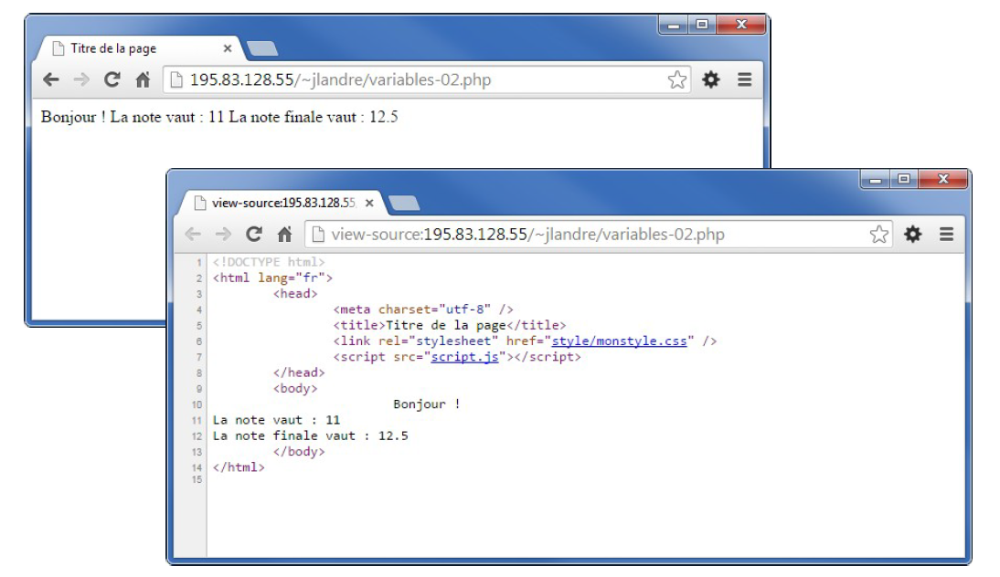

# Séance 2 : Eléments du langage

## Quelques bonnes pratiques

### Indentation du code 

Il est important d’indenter le code HTML mais aussi PHP pour faciliter la lecture et la recherche d’erreurs 



```php
<!DOCTYPE html>
<html lang="fr">
<head>
<title>Ma page avec du PHP</title>
<meta charset="utf-8" />
</head>
<body>
<?php
echo '';
?>
</body>
</html>
```



```php
<!DOCTYPE html>
<html lang="fr">
<head>
    <title>Ma page avec du PHP</title>
    <meta charset="utf-8" />
</head>
<body>
<?php
    echo '';
?>
</body>
</html> 
```



### Commentaires 

Les commentaires permettent de donner des informations et des explications lors de la lecture du code source PHP. Ils ne sont pas interprétés par le moteur.

Il existe des commentaires sur une seule ligne :

```php
<?php
    //j'affiche une image
    echo '';
?>
```

Et des commentaires sur plusieurs lignes 

```php
<?php
/*
cet affichage ne fonctionne pas
echo '';
je commente donc
*/
echo 'ici ca fonctionne';
?>
```

### Mise en page du code généré 

Si vous regardé le code généré \(afficher source de la page dans votre navigateur\), il est souvent difficile à lire. Il est possible de dire à PHP d’écrire ce code un peu plus "proprement". Pour sauter des lignes dans le code HTML généré, il faut utiliser le caractère spécial `\n` \(newline\) dans des chaînes délimitées par des guillemets.

```php
<?php
echo 'Bonjour !'."\n";
$note=11;
echo 'La note vaut : ';
echo $note."\n";
$bonus=1.5;
$note_totale=$note+$bonus;
echo 'La note finale vaut : '.$note_totale."\n";
?>
```

Le code ci-dessus donnera le résultat suivant :




Jusqu'a présent lors des `echo` on a utilisé le caractère ' pour délimiter une chaîne. **C'est la bonne pratique et c'est ce que je vous impose sur ce module**. Mais on peut aussi utiliser des " \(guillemets\), notamment dans le cas particulier des caractères "\n" ou encore "\r".


## Variables

* Une variable est un emplacement mémoire possédant un nom qui sert à stocker des informations 
* Une variable possède un type 
  * Entier, réel, booléen, chaîne de caractères, ... 
  * Tableau, arbre, pile, file, date, ...


En PHP, les variables commencent **TOUJOURS** par un **$ \(dollar\)**


### Nommage des variables

* Le nom d’une variable commence par un caractère non numérique 
* Le nom d’une variable doit correspondre à ce qu’elle contient \(pour faciliter la lecture\) 
* Les caractères spéciaux sont interdits dans le nom des variables 
* Les espaces sont interdits dans le nom des variables, tout comme les "." 
* Il est recommandé d’utiliser une notation "camelCase"


camelCase

La première lettre du nom d’une variable est toujours en minuscule, puis la première lettre de chaque mot composant le nom de la variable est en majuscule. Exemple : `$maVariable`, `$unLongNomDeVariable`.


### Affectations de variables

* Pour stocker quelque chose dans une variable PHP on utilise une affectation. 
* L'opérateur d'affectation est le = \(égal\) 

```php
<?php 
    $maVariable = 10; 
    $somme = 10 + 15; 
    $moyenne = $somme / 2; 
?>
```

### Opérations sur les variables

#### Les opérations arithmétiques classiques

```php
<?php 
$a = 1; 
$b = 3; 
$c = $a + $b; // addition 
$d = $a - $b; // soustraction 
$e = $a * $b; // multiplication 
$f = $a / $b; // division 
$g = $a % $b; // modulo (reste de la division)
?>   
```

Les opérations arithmétiques dans une forme réduite

```php
<?php 
$var = 5; 
$var++; //incrementation de 1, $var= $var + 1; 
$var--; //decrementation de 1, $var= $var - 1; 
$var += 2; //$var = $var + 2; 
$var -= 3; //$var = $var - 3; 
$var = 4; //$var = $var  4; 
$var /= 2; //$var = $var / 2; ?>

```

### Exercice

Considérons le code php suivant 



Qu'affiche le code ci-dessous ?

```php
<?php 
$monTexte = 'Bienvenue !'; // chaine 
$motDePasseUser = '123toto456'; // chaine du mot de passe 
$monNombreEntier = -10; // entier 
$monNombreReel = 3.1415; // reel 
$monBooleen = true; // booleen 
?>
```



Rien bien sûr ! Il n'y a aucun `echo`, donc aucun affichage de la part de PHP !



## Ruptures de séquence

* **Règle** : les programmes sont exécutés en lisant les instructions de gauche à droite et de haut en bas : **c'est la séquence d'instructions** 
* Dans certains cas, il est utile et/ou obligatoire de ne pas suivre cette règle 
* Il y a donc des instructions qui induisent une **rupture de cette séquence**
* Il y en existe trois en PHP : 
  * Les tests conditionnels \(ou conditions\) 
  * Les boucles 
  * Les appels de fonction

### Tests conditionnels

* Ils permettent d'effectuer des instructions si une certaine condition est remplie \(est vraie\) et/ou d'autres instructions lorsque la condition n'est pas remplie \(est fausse\) 
* Il en existe trois en php 
  * L'instruction if \(si\) 
  * L'instruction switch/case \(sélecteur à choix multiples\) 
  * Les conditions condensées \(ou notation ternaire\) 

#### L'instruction if 

L'instruction if permet de tester une condition et d'effectuer un bloc d'instructions si cette condition est **vraie**

```php
<?php 
$age=19; 
if ($age>=18) 
{ 
    echo 'Vous etes majeur !'; 
} 
?>
```

#### Bloc de séquence

Notez la présence des { } qui encadrent les instructions qui suivent le if \(ce qui sera exécuté en cas de test vrai\).

C'est ce qu'on appelle un bloc d'instruction. Toute séquence pourrait se trouver dans un bloc d'instruction.


Par contre, toute séquence qui est dans une rupture de séquence \(après un test \(if\), une boucle, une fonction, ...\) **DOIT** se trouver dans un bloc de séquence et entre { et }   


L'exemple ci-dessous introduit la partie else d'un test condition avec if. Ce else est le cas déclenché si la condition est fausse. Autrement dit dans l'exemple si dessous, si j'ai moins de 18.

```php
<?php 
$age=19; 
echo 'Regardons votre age :'."\n"; 
if ($age>=18) 
{ 
    echo 'Vous etes majeur !'."\n"; 
} else 
{ 
    echo 'Vous etes mineur !'."\n"; 
} 
echo 'Bienvenue en MMI !'."\n"; 
?>
```

Conditions et opérateurs de comparaison

Qu'est ce qu'une condition

Une condition est une expression qui peut prendre uniquement deux valeurs **booléennes** : vrai \(**true**\) ou faux \(**false**\) .

Exemples de condition : 

* L'âge est supérieur ou égal à 18 
* La taille est inférieure à 1,80 m 
* La surface est supérieure ou égale à 100 m² 
* L'âge est égal à 18 et la ville de naissance est Troyes 

Pour toutes ces expressions, il n'y a que **deux choix possibles** : vrai ou faux, ce sont donc des conditions.

#### Opérateurs de comparaison

Pour tester les valeurs des variables, on utilise les opérateurs de comparaison suivants : 

| Nom | Ecriture php |
| :--- | :--- |
| Egalité | == |
| Différence | != |
| Supériorité stricte | &gt; |
| Infériorité stricte | &lt; |
| Supériorité ou égalité | &gt;= |
| Infériorité ou égalité | &lt;= |

Pour lier entre elles plusieurs conditions, on utilise les opérateur et \(AND\), ou \(OR\) et non\(NOT\) :

| Nom | Ecriture PHP |
| :--- | :--- |
| Et \(and\) | && |
| Ou \(or\) | \|\| |
| Non \(not\) | ! |

```php
<?php 
if ($note>=10) { ... } 
if ($note=10) { ... } 
if ($age>=18) { ... } 
if ($age6 && $age=18 && ($ville=="Troyes" || $ville=="Romilly")){ ... } 
?>
```

####  Clause Else

L'instruction if peut aussi appeler un bloc d'instructions si la condition n'est pas vraie à l'aide de l'instruction **sinon** \(else\) : 

```php
<?php 
$age=19; 
if ($age>=18) 
{ 
    echo 'Vous etes majeur !' ; 
} else { 
    echo 'Vous etes mineur !' ; 
} 
?>
```

#### Clause Elseif 

On peut aussi enchaîner plusieurs conditions avec l'instruction elseif \(sinon si\):

```php
<?php 
if ($ville=="Troyes") 
{ 
    echo 'Vous etes troyen !'."\n"; 
} elseif ($ville=="Romilly") 
{ 
    echo 'Vous etes romillon !'."\n"; 
} elseif ($ville=="Bar sur AUbe") 
{ 
    echo 'Vous etes baralbin !'."\n"; 
} else 
{ 
    echo ''Vous habitez ailleurs !'."\n"; 
} 
?>
```


Switch/Case

L'instruction switch/case permet de traiter plusieurs conditions sous une forme réduite : 

```php
<?php 
switch ($ville) { 
    case "Troyes": 
        echo 'Vous etes troyen !'."\n"; 
    break; 
    case "Romilly": 
        echo 'Vous etes romillon !'."\n"; 
    break; 
    case "Bar-sur-Aube": 
        echo 'Vous etes baralbin !'."\n"; 
    break; 
    default: 
        echo 'Vous habitez ailleurs !'."\n"; 
} 
?>
```

L'instruction break permet de sortir du switch/case. Si on l'oublie, les instructions suivantes vont s'exécuter. 

Dans certains cas, il est utile de ne pas mettre de break quand plusieurs choix conduisent au même résultat :

```php
<?php 
$ville="Sens"; 
switch ($ville) { 
case "Troyes": 
case "Romilly": 
case "Bar-sur-Aube": 
    echo 'Vous etes aubois !'."\n"; 
break; 
case "Sens": 
case "Auxerre": 
    echo 'Vous etes icaunais !'."\n"; 
break; 
default: 
    echo 'Vous habitez ailleurs !'."\n"; 
} 
?>
```

#### Notation ternaire

Il est possible de condenser l'écriture d'un test sur une seule ligne avec l'instruction **\(condition\)?valeursivraie:valeursifausse;** 

```php
<?php $majeur=($age>=18)?true:false; ?>
```



On doit payer 10% d'impôts si on gagne moins de 1000 € / mois et 25% d'impôts à partir de 1000 € / mois. Ecrire un programme qui détermine le montant des impôts en fonction du salaire mensuel.







### Les boucles

Les boucles permettent de répéter plusieurs fois un même bloc d'instructions \(rupture de séquence\) 

Il existe 3 boucles en PHP : 

* La boucle for ... \(pour\) 
* La boucle while ... \(tant que\) 
* La boucle do ... while ... \(jusqu'à\)

#### Boucle FOR

La boucle for permet de répéter un bloc d'instructions quand on connaît a priori le nombre d'itérations \(nombre de boucles\) à effectuer. 

```php
<?php 
echo 'Punition'."\n"; 
for ($i=0; $i<100; $i++)
{ 
    echo 'Je dois apprendre mon cours !';
} 
?>
```

`$i` est la variable de boucle, c'est elle qui détermine le nombre d'itérations

Trois éléments dans les parenthèses : 

* Initialisation de la variable de boucle 
* Condition qui doit être vraie pour exécuter le bloc 
* Modification de la variable de boucle

```php
<?php 
echo 'Liste des entiers de 0 -> 10'."\n"; 
for ($i=0; $i<=10; $i++) 
{ 
    echo ''.$i.''."\n"; 
}
?>
```

```php
<?php
echo '<p>Liste des entiers pairs de 0 -> 10</p>'."\n";
for ($i=0; $i<=10; $i=$i+2) 
{
    echo '<p>'.$i.'</p>'."\n";
}
?>
```

```php
<?php
echo 'Liste des entiers impairs de 11 -> 1'."\n"; 
for ($i=11; $i>1; $i=$i-2) { 
    echo ''.$i.''."\n"; 
} 
?> 
```

#### Exercice







Ecrire une boucle qui fait la somme des nombres de 1 à 100, et qui affiche le résultat.



Boucle While

La boucle while permet de répéter un bloc d'instructions quand on ne connaît pas a priori le nombre d'itérations \(nombre de boucles\). 

```php
<?php 
echo 'Punition'."\n"; 
$i=0; 
while ($ < 100)
{
    echo $i.' Je dois apprendre mon cours !';
    $i++;
} 
```

`$i` est la variable de boucle, c'est elle qui détermine le nombre d'itérations 

Trois éléments : 

* Initialisation de la variable de boucle $i=0; \(on peut mettre autre chose que 0\) 
* Condition qui doit être vraie pour exécuter le bloc \($i&lt;100\) 
* Modification de la variable de boucle $i++; \(on peut agir différemment sur $i\)


Attention aux boucles infinies \(c'est à dire dont la condition ne serait jamais vérifiée !\). Ces boucles feront forcément planter votre serveur PHP




Ecrire une boucle \(avec un while\) qui affiche tous les nombres impairs \(à partir de 2\), inférieurs à 20.







#### Boucle Do ... While

La boucle `do … while …` permet de répéter un bloc d'instructions quand on ne connaît pas a priori le nombre d'itérations \(nombre de boucles\) au moins une fois. 

```php
<?php 
echo 'Punition'."\n".''; 
$i=0; 
do 
{ 
    echo 'Je dois apprendre mon cours ! '."\n"; 
    $i++; 
} while ($i < 100)
?> 
```

`$i` est la variable de boucle, c'est elle qui détermine le nombre d'itérations.

 Trois éléments : 

* Initialisation de la variable de boucle $i=0; \(on peut mettre autre chose que 0\) 
* Condition qui doit être vraie pour exécuter le bloc \($i&lt;10\) 
* Modification de la variable de boucle $i++; \(on peut agir différemment sur $i\) 


