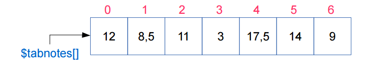
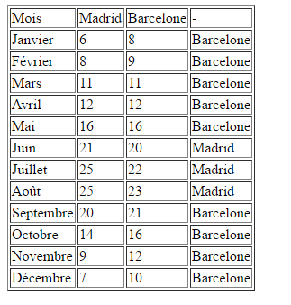

# Séance 7 : Manipulation des tableaux PHP

## Introduction

En PHP, un tableau est une collection \(liste d’éléments\) ordonnée de couples clé/valeur.

La clé peut être de type entier ou de type chaîne. Dans le premier cas, le tableau est dit numérique et la clé est désignée par le terme indice. Dans le deuxième cas, le tableau est dit associatif : les clés ne sont pas forcément consécutives, ni ordonnées, et ce tableau peut présenter des clés entières et des clés de type chaîne.

La valeur associée à la clé peut être de n’importe quel type, et notamment de type tableau ; dans ce cas, le tableau est dit multidimensionnel.

## Tableaux indexés en PHP

Les tableaux sont une structure de données qui permet de stocker une suite de valeurs en mémoire sous un seul nom, chaque valeur est repérée par un numéro



La taille **t** du tableau donne son nombre d'éléments, dans l’exemple ci-dessus, **t = 7**. Les indices de tableau vont de 0 à t-1. En php, pour connaitre la taille d’un tableau on utilise l’instruction `count($tableau)`, ou `$tableau` est la variable de **type array** pour laquelle vous souhaitez connaître la taille. Essayez le code ci-dessous pour voir le résultat.



```php
<?php
// Creer un tableau vide
$tabNotes = array();

// Ajouter de nouvelles valeurs a un tableau
$tabNotes[] = 12.5;
$tabNotes[] = 9;

// Afficher les valeurs
echo 'La valeur à l\'indice 0 est:'. $tabNotes[0];
echo 'La valeur à l\'indice 1 est:'. $tabNotes[1];

// Ajouter une autre note
$tabNotes[] = 11;

// Changer une note puis afficher la nouvelle valeur
$tabNotes [1] = 8;
echo 'La valeur à l\'indice 1 est:'. $tabNotes[1];
?>
```



Le code ci-dessous montre une façon de manipuler un tableau afin de calculer une moyenne. Essayez le code et pour voir le résultat.



```php
<?php
// Creer un tableau rempli
$tabNotes = array (12.5 , 9 , 11);

// Ajouter de nouvelles valeurs a un tableau
$tabNotes[] = 7;
$tabNotes[] = 12.5;

// Calculer la moyenne
$somme = $tabNotes[0] + $tabNotes[1] + $tabNotes[2] + $tabNotes[3] + $tabNotes[4];

echo 'La somme vaut :'. $somme;
$moyenne = $somme / 5;

echo 'La moyenne vaut :'. $moyenne;
?>
```




Quel est l'inconvénient de l'exemple précédent ?

Evidemment cette solution n’est pas pleinement satisfaisante. En effet, il est rare d’avoir un tableau d’uniquement 5 valeurs. La programmation \(que ce soit web ou autre\), doit nous faciliter la tâche dans la manipulation d’un tableau. Il serait donc plus judicieux d'écrire un code qui fonctionne quelque soit le nombre de case dans un tableau.


Le code ci-après, permet de manipuler un tableau, sans connaître, a priori, la taille de ce dernier.



```php
<?php
// Creer un tableau rempli
$tabNotes = array (12.5 , 9 , 11 , 7 , 12.5);

$somme = 0; // initialiser une variable


// Parcourir un tableau
for ($i = 0; $i < count($tabNotes); $i ++)
{
 $somme= $somme + $tabNotes[$i];
}

// Calculer la moyenne
$moyenne = $somme / count($tabNotes);
echo '<p>La moyenne vaut :'. $moyenne .'</p>';
?>
```



Le code ci-dessus parcoure un tableau de l'index 0 \(`$i=0`\), jusqu'au dernier élément \(`$i<count($tabNotes)`\). De cette manière, pour accéder à un élément, on doit utiliser la variable de boucle $i afin d'accéder à l'élément sur lequel la boucle se trouve. De manière itérative, l'ensemble des éléments seront ajoutés à la variable $somme.

## Tableaux associatifs en PHP

Un tableau associatif en PHP est un tableau dont les indices ne sont pas des nombres, mais des chaînes de caractères. Un tableau associatif permet donc d’associer un nom à une valeur dans un tableau.

```php
<?php
// Creer un tableau associatif rempli
$tabAssoNotes = ['matiere' => 'm1202',
                 'note1' => 12,
                 'note2' => 7,
                 'note3' => 11.5];

// Afficher les valeurs
echo '<p>'. $tabAssoNotes['matiere']. ': '.
   $tabAssoNotes['note1']. ', '.
   $tabAssoNotes['note2']. ', '.
   $tabAssoNotes['note3']. ' </p>';

?>
```


La syntaxe ci-dessous est à privilégier avec les versions 5.6 et supérieures de PHP

```php
$tabAssoNotes = ['matiere' => 'm1202',
                 'note1' => 12,
                 'note2' => 7,
                 'note3' => 11.5];
```

Elle est équivalente à la syntaxe ci-dessous :

```php
$tabAssoNotes = array('matiere' => 'm1202',
                 'note1' => 12,
                 'note2' => 7,
                 'note3' => 11.5);
```


Dans ce type de tableau, on peut donc accéder aux notes directement avec un nom 'note1', 'note2', 'note3'. L’ordre dans lequel les éléments sont dans le tableau n'a donc plus d'importance, a priori. Car on y accède avec un nom. On peut également mélanger différentes données \(un nom de matière et des notes\). 

Une nouvelle fois, puisqu’on ne connait pas forcément la taille du tableau, ni forcément toutes les clés, on peut parcourir le tableau avec une boucle.

```php
<?php
//Creer un tableau associatif rempli
$tabAssoNotes = ['matiere' => 'm1202',
                 'note1' => 12,
                 'note2' => 7,
                 'note3' => 11.5];

echo '<p>';
// Afficher les valeurs

foreach ( $tabAssoNotes as $cle => $valeur )
{
     echo $cle .': '. $valeur .'<br />';
}
echo '</p>';
?>
```

La notation `$cle => $valeur` implique que pour chaque 'case' du tableau associatif on recopie dans `$cle` le 'nom' de la case, la **clé**, et dans `$valeur` le contenu de la 'case', la **valeur**.


La structure de langage _foreach_ fournit une façon simple de parcourir des tableaux.

[https://www.php.net/manual/fr/control-structures.foreach.php](https://www.php.net/manual/fr/control-structures.foreach.php)


## Exercices

### Exercice 1 : Comparaison de température

Vous hésitez pour partir vous installer entre Madrid et Barcelone, vous voulez aller dans la ville la plus chaude en moyenne. On vous donne les informations suivantes :

```php
<?php
// temperatures moyennes mensuelles de Barcelone
$tabBarcel = [8 ,9 ,11 ,12 ,16 ,20 ,22 ,23 ,21 ,16 ,12 ,10];
// temperatures moyennes mensuelles de Madrid
$tabMadrid = [6 ,8 ,11 ,12 ,16 ,21 ,25 ,25 , 20 ,14 ,9 ,7];
?>
```

Chaque case correspond à un mois de l’année, dans l’ordre chronologique. 

1. Ecrire un programme pour afficher dans un tableau HTML ces deux tableaux 
2. Créer un tableau pour afficher dans chaque ligne de votre tableau le mois correspondant
3. Modifier le programme, pour que sur chaque mois, on puisse lire la ville la plus chaude

On doit obtenir le résultat ci-dessous : 



